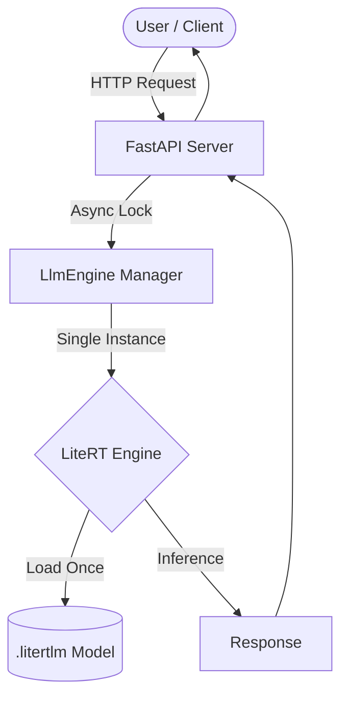

# Edge AI API - LiteRT-LM

A high-performance, lightweight OpenAI-compatible API server designed for running LLMs on low power edge devices (Raspberry Pi, Banana Pi, etc.). This project leverages **LiteRT-LM** to provide a fast and efficient inference engine with full support for multi-modal inputs.

### 🌟 Recommended Models
- **Gemma 2B IT**: [Download](https://huggingface.co/litert-community/gemma-4-E2B-it-litert-lm/resolve/main/gemma-4-E2B-it.litertlm)
- **Gemma 4B IT**: [Download](https://huggingface.co/litert-community/gemma-4-E4B-it-litert-lm/resolve/main/gemma-4-E4B-it.litertlm)

## 🚀 Key Highlights

- **Local Models**: Create a folder named `models/` and place the downloaded models in it.
- **LiteRT Compression**: All models are compressed to the LiteRT format, ensuring they fit and run efficiently on resource-constrained hardware.
- **Full Modality Support**: Full support for **Vision** (image input), **Tool Calling**, and **Audio Input**.
- **Edge Device Optimized**: Designed for seamless integration with **OpenClaw** or any Open AI API supported projects on low power devices like Raspberry Pi or older hardware.
- **Universal Compatibility**: Supports any `.litertlm` model file.

## 🏗 Architecture

The system is built with FastAPI and designed for maximum resource efficiency.



## 🧠 Memory Management & Performance

### Instance Recycling
To minimize memory footprint on edge devices, the server maintains a single instance of the `LlmEngine`. The model is loaded into memory only once and persists across all subsequent requests. This avoids the overhead of reloading multi-gigabyte models for every interaction.

### Async Concurrency
By using FastAPI's asynchronous nature, the server can handle I/O-bound tasks efficiently while the LLM engine performs heavy computation.

## ⚠️ Current Limitations

- **One Model at a Time**: The server is designed to serve a single model (configured via environment variables). Switching models requires a restart to free and reallocate system resources.
- **Strictly Sequential Requests**: To prevent memory exhaustion and ensure stable performance on low-power hardware, the API processes **one request at a time**. Incoming requests are queued using an asynchronous lock.

## 🛠 Features

- **Standard OpenAI Chat Completions API** (`/v1/chat/completions`)
- **Streaming Support**: Real-time token streaming with performance metrics (TPS, TTFT).
- **Multi-modal Input**:
  - **Text**: Standard Dhivehi and English support.
  - **Images**: Vision support via base64 `image_url`.
  - **Audio**: Audio input support via base64 `input_audio`.
- **Tool Calling**: Native support for LLM-driven function calling.

## 🏃 Getting Started

### Prerequisites
- Python 3.10+
- Models in LiteRT format (placed in `models/` directory)

### Installation
1. Clone the repository.
2. Install dependencies:
   ```bash
   pip install -r requirements.txt
   ```
3. Set up your environment in `.env`.

### Running with Docker
```bash
docker-compose up -d
```

## ⚙️ Configuration

| Variable | Description | Default |
|----------|-------------|---------|
| `LLM_MODEL` | Filename of the model (without extension) | `gemma-4-4B-it` |
| `LLM_BACKEND` | Inference backend (CPU/GPU) | `CPU` |
| `UVICORN_PORT`| Server port | `8000` |

---

## 🤝 Contributing

Any and all contributions are welcomed! I love to see this project grow. Feel free to open issues or submit pull requests to help improve this edge-optimized API.


